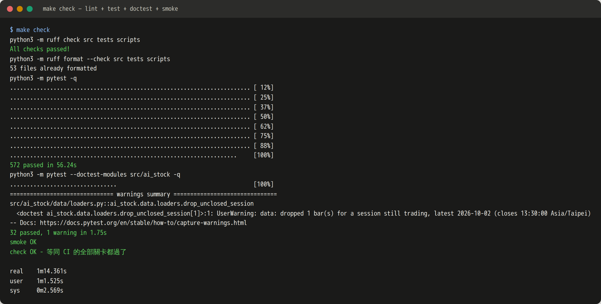
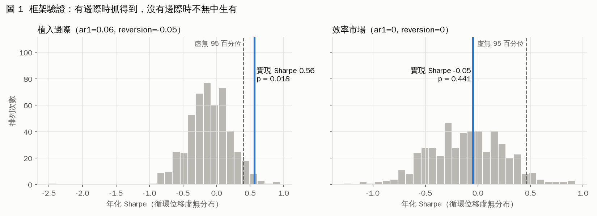
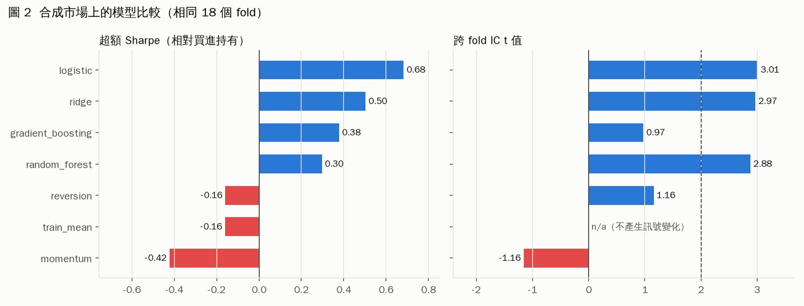
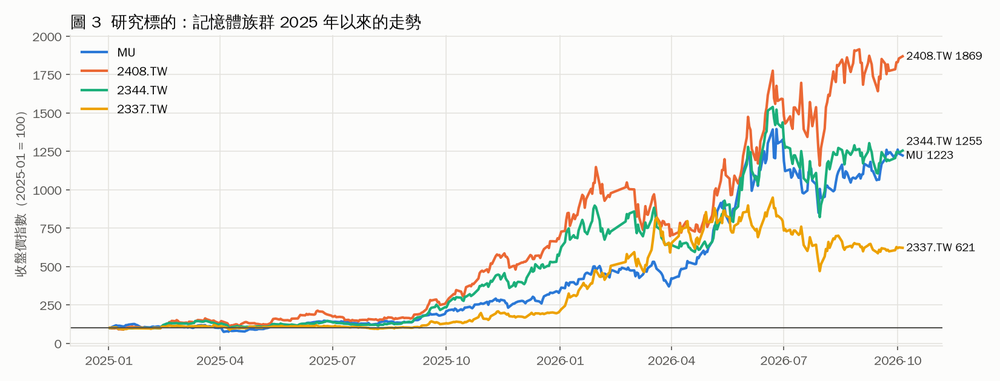
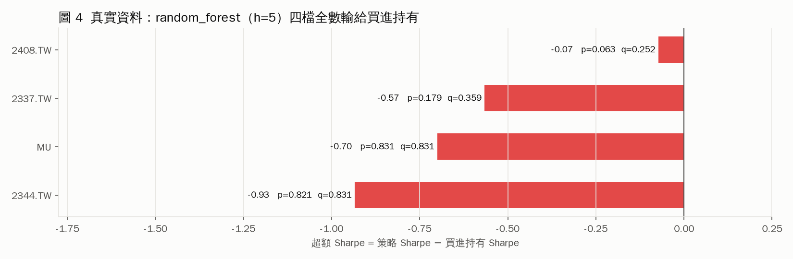
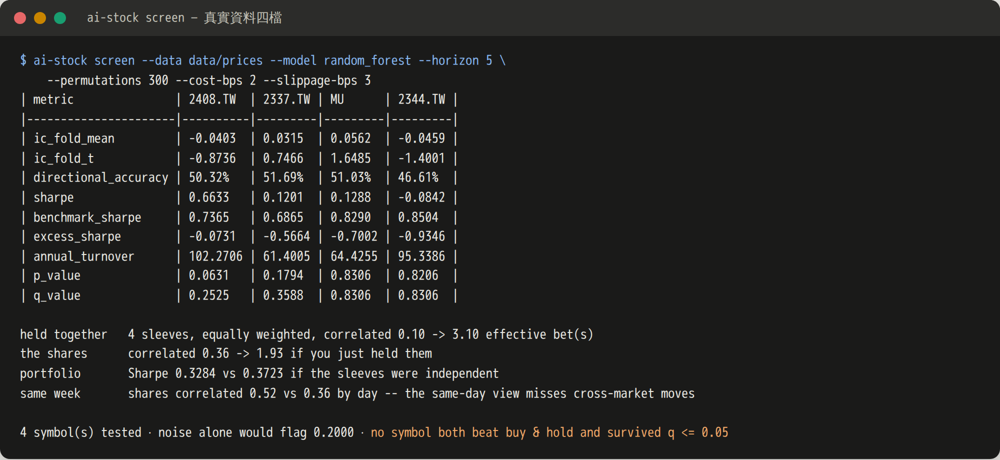
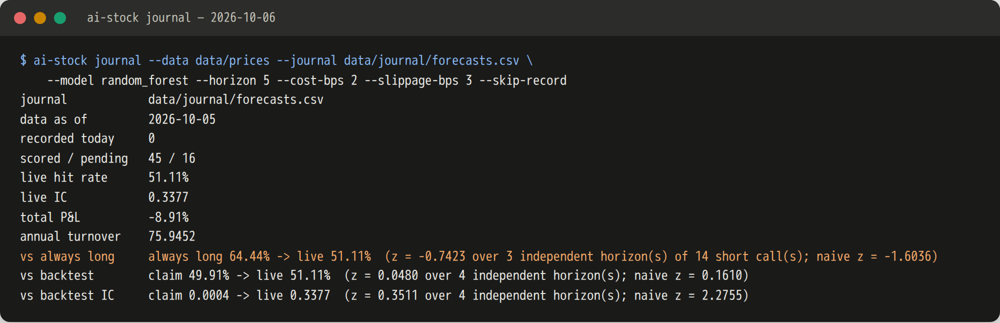
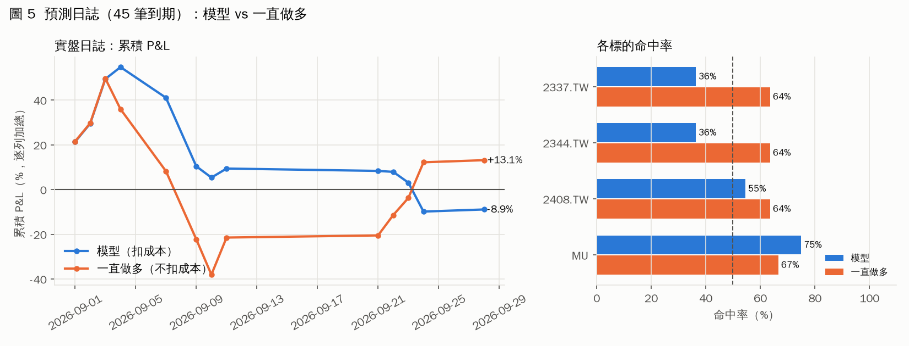

# 測試執行報告 — 2026-10-06

一次完整的端到端執行：先跑等同 CI 的全部關卡，再用同一份程式碼做四組實驗——
合成市場上的框架驗證、合成市場上的模型比較、真實資料上的族群篩選、以及預測
日誌的實盤計分。所有數字都來自 CLI 的原始輸出，圖表只是把那些數字畫出來。

| 項目 | 值 |
|---|---|
| 程式碼版本 | `main` @ `332a010`（含 PR #39） |
| 價格資料 | `data/prices/`，四檔最新 bar 皆為 2026-10-05（MU 前一天落後的那一場已補上） |
| 預測日誌 | `data/journal/forecasts.csv`，61 列（45 到期 / 16 在途），**未經改動** |
| 圖表 | `scripts/make_report_figures.py`（matplotlib，僅此腳本需要） |

> ⚠️ 研究輸出，**不構成任何投資建議**。

---

## 結論先講

1. **框架本身是健康的。** 572 項測試、32 項 doctest、CLI 冒煙測試全數通過；合成市場上
   植入的邊際被抓到（p = 0.018），效率市場上沒有無中生有（p = 0.441）。
2. **真實資料上沒有邊際。** `random_forest`（5 日期距）在四檔記憶體股上**全數輸給買進持有**，
   沒有任何一檔通過 FDR 校正（最小 q = 0.25）。
3. **實盤日誌還太短，什麼都不能下結論**——但它今天示範了為什麼。45 筆到期預測只涵蓋
   4 個不重疊的期距；昨天看起來 +6.8% 的「勝過一直做多」，今天變成 −22.0%，一天內翻號。

---

## 1. 測試關卡：`make check`



| 關卡 | 內容 | 結果 |
|---|---|---|
| lint | `ruff check` + `ruff format --check`（`src tests scripts`） | ✅ 通過 |
| test | `pytest -q` | ✅ 572 passed（56.2 秒） |
| doctest | `pytest --doctest-modules src/ai_stock` | ✅ 32 passed |
| smoke | CLI 端到端：`data → compare → simulate → screen` | ✅ smoke OK |
| 合計 | | **1 分 14 秒** |

唯一的 warning 來自 `drop_unclosed_session` 的 doctest，是它刻意觸發的（示範丟棄一根
盤中 bar），不是缺陷。同一個 commit 在 GitHub Actions（CI run 147）上，Python 3.10 / 3.11 /
3.12 三個版本也全數通過。

---

## 2. 框架驗證：它會不會無中生有？

同一個 `ridge` 模型、同樣 3000 個交易日、同一個亂數種子，只差在合成市場有沒有植入可預測成分。



| 市場 | 實現 Sharpe | 虛無平均 | 虛無 95 百分位 | p 值 | Sharpe 90% CI | 結論 |
|---|---|---|---|---|---|---|
| 植入邊際（`ar1=0.06, reversion=-0.05`） | **0.5646** | −0.107 | 0.404 | **0.018** | [0.049, 1.128] | 還原了已知訊號 |
| 效率市場（`--efficient`） | −0.0464 | −0.106 | 0.461 | 0.441 | [−0.666, 0.606] | 沒有偽陽性 |

虛無分布用的是**循環位移**（rotation）：保留訊號本身的自相關與換手率，只破壞訊號與未來
報酬的時序對齊。圖上灰色長條是 500 次位移的 Sharpe，藍線是實際值。有邊際時藍線落在
95 百分位右邊，沒有時落在分布中間——這正是一個不會自欺的框架該有的樣子。

圖表腳本用 `run_simulation` 重算了這兩組虛無分布，得到的 p 值（0.0180 / 0.4411）與 CLI
輸出逐位一致。

---

## 3. 模型比較（合成市場，相同 18 個 fold）



| 模型 | `ic_fold_mean` | `ic_fold_t` | 方向準確率 | Sharpe | 超額 Sharpe | 最大回撤 | 年換手 |
|---|---|---|---|---|---|---|---|
| logistic | 0.0749 | **3.01** | 51.57% | **0.74** | **0.68** | −50.1% | 103× |
| ridge | 0.0832 | 2.97 | 51.48% | 0.56 | 0.50 | −36.8% | 104× |
| gradient_boosting | 0.0248 | 0.97 | 50.30% | 0.44 | 0.38 | −40.1% | 159× |
| random_forest | 0.0882 | 2.88 | 50.48% | 0.36 | 0.30 | −43.7% | 92× |
| reversion（基準） | 0.0292 | 1.16 | 49.86% | −0.10 | −0.16 | −57.5% | 251× |
| train_mean（基準） | n/a | n/a | 49.84% | −0.10 | −0.16 | −46.3% | 0.6× |
| momentum（基準） | −0.0292 | −1.16 | 50.09% | −0.36 | −0.42 | −72.1% | 251× |

三個線性／樹模型的 IC t 值都在 2.9 以上，四個無技巧基準全部是負的超額 Sharpe——合成市場
上「有學到東西」和「沒學到東西」分得很清楚。注意方向準確率：**最好的模型也只有 51.6%**。
一個真實存在、而且被正確抓到的邊際，在準確率上就只長這樣。

---

## 4. 真實資料：族群篩選

研究標的是 `config/universe.txt` 的四檔記憶體股。2025 年以來它們漲了 6 到 19 倍：



在這樣的多頭裡，任何一個會做空的模型都要先贏過「什麼都不做」這個門檻。





| 標的 | IC t | 方向準確率 | 策略 Sharpe | 買進持有 Sharpe | **超額 Sharpe** | p | **q（BH）** |
|---|---|---|---|---|---|---|---|
| 2408.TW 南亞科 | −0.87 | 50.32% | 0.663 | 0.736 | **−0.073** | 0.063 | **0.252** |
| 2337.TW 旺宏 | 0.75 | 51.69% | 0.120 | 0.687 | **−0.566** | 0.179 | **0.359** |
| MU 美光 | 1.65 | 51.03% | 0.129 | 0.829 | **−0.700** | 0.831 | **0.831** |
| 2344.TW 華邦電 | −1.40 | 46.61% | −0.084 | 0.850 | **−0.935** | 0.821 | **0.831** |

- **四檔的超額 Sharpe 全是負的。** 按 README 的判讀順序，這裡就可以停了。
- 最接近顯著的 2408.TW，原始 p = 0.063，經四檔的多重檢定校正後 q = 0.252。同時篩四檔，
  純雜訊預期就會標記 0.20 檔。
- 合在一起持有：四條策略腿彼此相關 0.10，等於 3.10 個有效賭注（直接持有股票則是 1.93 個）；
  但如 README 所說，**腿與腿去相關不自動是好消息**——互相亂猜的模型看起來就是這樣。

---

## 5. 預測日誌：唯一無法事後調整的分數





### 5.1 總表

| 指標 | 今天（2026-10-06） | 昨天（2026-10-05） | 變化 |
|---|---|---|---|
| 已到期 / 在途 | 45 / 16 | 41 / 16 | +4 |
| 獨立期距 `n_independent` | 4 | 4 | — |
| live 命中率 | 51.11% | 53.66% | −2.55pp |
| live IC | 0.3377 | 0.4239 | −0.086 |
| 總 P&L（扣成本） | **−8.91%** | +4.64% | **−13.55pp** |
| vs 回測 `hit_rate_z` | +0.048 | +0.147 | |
| 一直做多命中率 | 64.44% | 60.98% | |
| `skill_z`（McNemar，空單） | −0.742（naive −1.604） | −0.472（naive −0.905） | |
| 一直做多 P&L | +13.14% | −2.20% | |
| **`pnl_gap`** | **−22.04%** | **+6.84%** | **翻號** |
| **`pnl_gap_z`** | −0.181（naive −0.607） | +0.066（naive +0.212） | |

### 5.2 一天翻號的那 4 筆

| 預測日 | 標的 | 部位 | 5 日實現報酬 | 扣成本 P&L |
|---|---|---|---|---|
| 2026-09-24 | 2337.TW | 空 | +3.77% | −3.77% |
| 2026-09-24 | 2344.TW | 空 | +5.39% | −5.39% |
| 2026-09-24 | 2408.TW | 空 | +5.23% | −5.33% |
| 2026-09-28 | MU | 多 | +0.94% | +0.94% |
| **合計** | | | | **−13.55%** |

同一天、同一族群的三張空單，在同一波上漲裡一起錯。這就是 `independent_blocks` 把
「同一期距內的所有預測，不分標的，算成一個觀測」的理由：表面上是 3 筆錯誤，實際上是
**一次**判斷錯誤被看了三遍。

昨天的報告上，`pnl_gap` = +6.8% 擺在一個比一直做多還差的命中率旁邊，是整份報告唯一
可能被誤讀成「模型有本事」的數字。PR #39 當天替它加上了標準誤：`pnl_gap_z` = 0.07，
雜訊。隔天它就翻成 −22.0%——那個標準誤說的正是這件事。

### 5.3 各標的

| 標的 | 到期筆數 | 模型命中率 | 一直做多命中率 | 總 P&L |
|---|---|---|---|---|
| MU | 12 | **75.0%** | 66.7% | +20.19% |
| 2408.TW | 11 | 54.5% | 63.6% | −2.54% |
| 2337.TW | 11 | 36.4% | 63.6% | −6.72% |
| 2344.TW | 11 | 36.4% | 63.6% | −19.84% |

整份紀錄唯一贏過一直做多的是 MU，而它的領先幾乎全來自一筆：2026-09-04 的空單，那一期
MU 跌了 9.5%。拿掉這一列，MU 的總 P&L 從 +20.2% 降到 +10.7%，而它在一直做多同樣賺錢的
列上只是跟著做多。12 筆、約 4 個獨立期距，一筆就能決定排名——這正是樣本太小的樣子。

另外，roadmap 2026-10-03 那一項記錄了一段時間內 MU 的列是在行情晚到一場的情況下寫下的：
模型沒有看到未來，但那幾列的結果視窗在寫下時已經開始。那些列依規定保留原樣不改。

### 5.4 判讀

- **`n_independent` = 4。** 少於 30 筆獨立觀測時 z 值不管發生什麼都接近 0。現在說什麼都太早。
- **`hit_rate_z` = +0.05**，離 −2 很遠：**沒有衰退訊號**，live 和回測宣稱的 49.9% 一致。
  但回測宣稱的本來就是一枚硬幣。
- **真正該看的是 `vs always long`。** 命中率差 −13.3 個百分點，`skill_z` 從 −0.47 走到 −0.74；
  仍不顯著，但方向一直是負的。模型的全部技巧宣稱押在 14 張空單上，目前對了 4 張。

---

## 6. 重現這份報告

```bash
make check                                   # 第 1 節

R=/tmp/run
ai-stock data --days 3000 --seed 42 --out $R/synthetic.csv --quiet
ai-stock simulate --data $R/synthetic.csv --model ridge --paths 1000 --out $R/edge
ai-stock simulate --days 3000 --seed 42 --efficient --model ridge --paths 1000 --out $R/eff
ai-stock compare --data $R/synthetic.csv \
    --models zero,train_mean,momentum,reversion,ridge,logistic,random_forest,gradient_boosting \
    --out $R/compare
ai-stock screen --data data/prices --model random_forest --horizon 5 \
    --permutations 300 --cost-bps 2 --slippage-bps 3 --out $R/screen
ai-stock journal --data data/prices --journal data/journal/forecasts.csv \
    --model random_forest --horizon 5 --cost-bps 2 --slippage-bps 3 \
    --skip-record --out $R/journal       # --skip-record：不寫日誌

pip install matplotlib                       # 只有畫圖需要
python3 scripts/make_report_figures.py --run-dir $R --out docs/reports/<date>/img
```

`--skip-record` 是必要的：日誌每天由 GitHub Actions 記錄一次，手動重跑時若漏了這個旗標，
會用比原始那天更多的資料配適出一列新預測——那正是本專案拒絕的事後調整。
